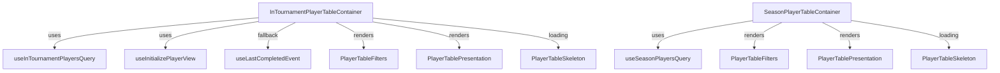

# Player Table Component Architecture

## Overview

The Player Table feature is designed for performance, maintainability, and clarity. It separates data fetching, state, and presentation, and supports both in-tournament (live) and season-long stats views.

---

## Component Structure

- **Container Components**
  - `InTournamentPlayerTableContainer`: Handles in-tournament (live) stats, event/round selection, and fallback to last event results.
  - `SeasonPlayerTableContainer`: Handles season stats and data source selection.
- **Presentation Component**
  - `PlayerTablePresentation`: Purely presentational, renders the table UI using TanStack Table.
- **Filters**
  - `PlayerTableFilters`: Renders filter controls (event, round, data source selectors).
- **Skeleton Loader**
  - `PlayerTableSkeleton`: Shows a loading skeleton during data fetches.
- **Hooks**
  - `useInTournamentPlayersQuery`: Fetches live or historical in-tournament stats.
  - `useSeasonPlayersQuery`: Fetches season stats.
  - `useInitializePlayerView`: Manages event/round selection state.
  - `useLastCompletedEvent`, `useUpcomingEvent`: Utility hooks for event context.

---

## Data Flow

- **Containers** fetch data using hooks and manage state (event, round, data source).
- **Presentation** receives a TanStack Table instance and renders the UI.
- **Filters** update state in the container, triggering new queries.
- **Fallback Logic**: If no live event, in-tournament container fetches and displays last completed event results.

---

## Mermaid Diagram

---

## Extension Points

- **Add new filters** by extending `PlayerTableFilters` and passing new state to the container.
- **Add new data sources** by updating hooks and query keys.
- **Customize columns** in `columns.tsx` and pass to the presentation component.

---

## Best Practices

- Keep containers focused on data/state, and presentation components stateless.
- Use Suspense and skeletons for loading states.
- Use the query key factory for all React Query hooks.
- Document new patterns in this file as they emerge.

## Patterns & Conventions

- Always use container components for data fetching and state, and keep presentation components stateless.
- Use Suspense and skeleton loaders for all async table data.
- All React Query keys must be created with the `queryKeys` factory.
- Use event context hooks (`useInitializePlayerView`, `useLastCompletedEvent`, `useUpcomingEvent`) for all event-driven logic.
- Add new filters or data sources by extending the container and filter components.
- Document any new patterns here as they emerge. 